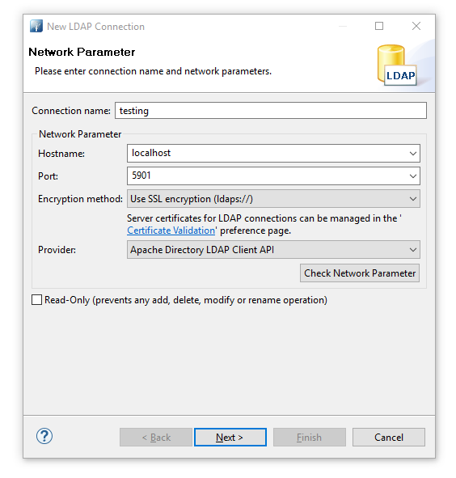
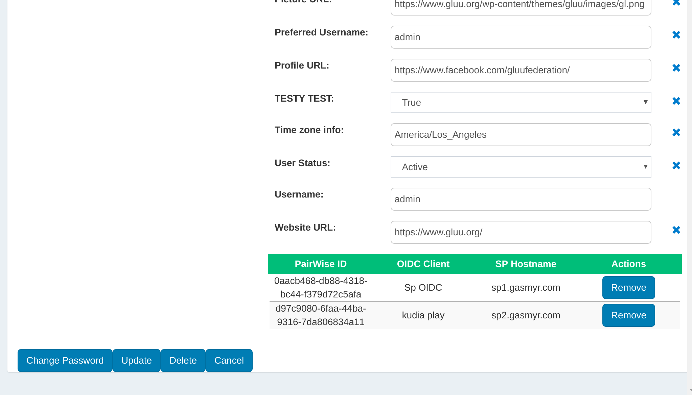
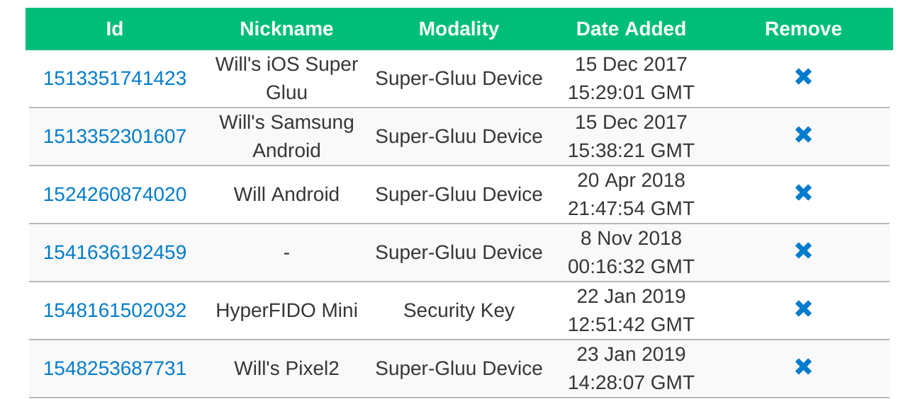
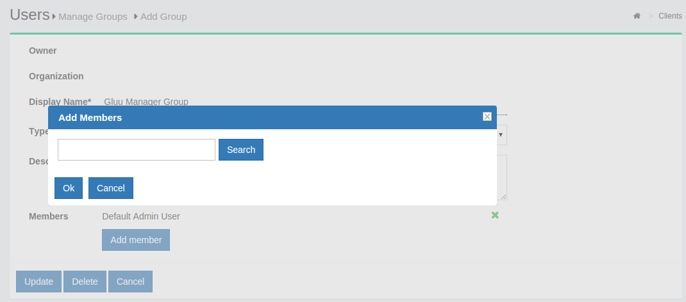
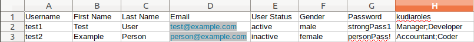

# Local User Management
In this document we cover managing people in the Gluu Server's LDAP Directory and graphical user interface "oxTrust".

## Manage data in Gluu LDAP
All the data generated by the Gluu Server is stored in the local LDAP server included in every deployment. This includes OpenID Connect client data, session data, tokens, user data, and more. 

Use an LDAP browser like [JXplorer](http://jxplorer.org/) and can find the configuration in `/opt/gluu-server/etc/gluu/conf/ox-ldap.properties`, e.g.:

For Gluu OpenDJ, it will look like this: 

```
bindDN: cn=directory manager
bindPassword: foobar
servers: localhost:1636
```

!!! Note
    This may look slightly different if using other LDAP servers.

Establish a tunnel from your computer to the target Gluu Server's LDAP. Tunneling is required because Gluu Server's LDAP port, 1636, is not exposed to the internet.

In the below example we are showing how to connect and use Gluu Server's internal LDAP server with any LDAP browser. 

 - Create tunnel:   
   - `ssh -L 5901:localhost:1636 root@[ip_of_Gluu_server]`
 - Open LDAP browser        
   - Create new connection 
       
   - Perform authentication. 'Password' is the the password of 'admin' user.  
        
   - Browse ldap and go to 'ou=people'.           
            


## Manage People
Managing data associated with people can be performed in both oxTrust, the admin GUI, as well as LDAP. To manage people in oxTrust, navigate to `User` > `Manage People`.

From this interface you can add and search users. Because the user database can potentially be very large, a value with at least two characters is required in the search field. In other words, you can not click search with a blank entry to populate all users. If you need to see all users, this would be best performed manually within the [Gluu LDAP server](#manage-data-in-gluu-ldap). Upon performing a user search in oxTrust a list will be populated with all users that match the search.


To edit a user, simply click on any of the hyperlinks associated with
that user and you will be taken to a user management interface where you
can modify specific attributes relating to that user.


### Managing associated Pairwise IDs
If the user has any associated [Pairwise IDs](../admin-guide/openid-connect.md#subject-identifier-types), they will be displayed in a table on the bottom of the page. If an associated Pairwise ID needs to be removed, just click the `Remove` button.



### Managing associated 2FA devices

Likewise, if the user has any associated 2FA devices, they will be displayed in their own table at the bottom of the page. If an associated 2FA device needs to be removed, just click the `Remove` button.



### Managing associated authorizations 

If the user has previously granted authorization to release their data to specific applications, this can be managed in LDAP. There is a branch called `ou=clientAuthorizations,inum=...,ou=people,o=...,o=gluu`

There can be several `oxId= ...` entries underneath. Every entry has the `oxAuthClientId` attribute, which is the inum of the OpenID client for which the user has authorized consent. 

To remove consent for a user/client pair, manually remove the corresponding `oxId=...` subentry.

To also remove the refresh tokens, check the clients branch `ou=clients,o=...,o=gluu`.

Under the `oxAuthGrantId=...` branch, there will be subentries for `uniqueIdentifier=...`. Those have the following attributes which map client, user and type of token issued: `oxAuthClientId`, `oxAuthUserId`, `oxAuthTokenType`. Delete the `uniqueIdentifier=...` entries as needed. oxAuth will also clear those automatically as per the `oxAuthExpiration` attribute. 

## Manage Groups in oxTrust
Out of the box, the Gluu Server includes one group: the Gluu Manager Group (`gluuManager`). Groups can be added and populated as needed. By using the `Manage Groups` feature, the Gluu Server Administrator can add, delete or modify any group or user within a group. The list of available groups can be viewed by hitting the `Search` button with a blank search box.  


The Gluu Server Administrator can modify information such as Display Name, Group Owner, Visibility type etc. The Server Administrator can also add or delete users within existing groups. The group information is represented as shown below.


If any member of the Organization is required to be added in any specific group, this can be achieved be clicking on the Add Member button. The flow is _Add Member --> Search the name/email of the user --> Select the user --> Click OK --> Update._



## Import People in oxTrust

Users can be imported from an excel file by navigating to `Users` > `Import People`.


- Click the `Add` button to select the file for import. Supported file formats are `xls` and `xlsx`.

- If one field contains multiple values, provide them in the same cell separated by semicolons, as shown in column H in the following example:



- Click the `Validate` button to validate the user list.   

    

- Click `Import` to complete the import of users.     

### File structure

The excel file can contain the following default fields (with spelling matching exactly as below):  

- Username (*required*)    

- First Name (*required*)

- Last Name (*required*)

- Email (*required*)

- Password

- User Status

!!! Note
    If `User Status` is not included, the user(s) will be set to Inactive. 

Additional fields can be defined for import by navigating to `Organization Configuration` > `JSON Configuration` and selecting the tab for `oxTrust Import Configuration`. [Read the docs](../admin-guide/oxtrust-ui.md#oxtrust-import-configuration).    
