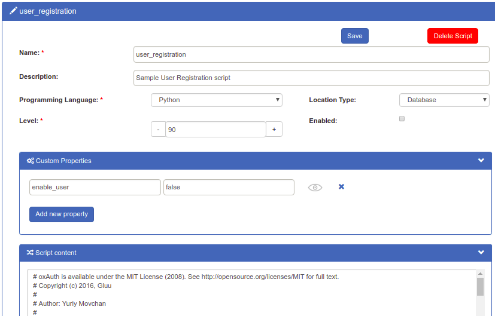

# User Registration 

## Overview
The Gluu Server includes two custom scripts to support a self-service user registration process:

- user_registration: This script implements a very basic user registration process *without* email activation. 

- user_confirm_registration: This script adds an email activation sequence to the user registration process.  

!!! Note
    To implement a custom registraton workflow (*recommended!*), follow the tutorial in our [SCIM 2.0 docs](./scim2.md#supporting-a-user-registration-process-with-scim).

## Enable User Registration  
To enable user registration via the Gluu Server, follow these steps:  

1. Navigate to `Manage Custom Scripts` and select the `User Registration` tab.   

1. Enable the `user_registration` script and press save.

    
    
1. To add an email activation sequence, also enable the `user_confirm_registration` script and [configure SMTP](https://gluu.org/docs/ce/admin-guide/oxtrust-ui/#smtp-server-configuration).   

1. New users will now be able to register for accounts at: `https://<hostname>/identity/register`.     

## Adding Attributes to Registration  
A limited number of attributes are present in the default registration form. More attributes can be added as needed by following the doc for [adding attributes](../admin-guide/oxtrust-ui.md#manage-registration).  

## Manual Approval of New Users
By default, the `Custom property (key/value)` field will include the values: `enable_user` and `true`. This enables new users to sign in as soon as registration is complete. If new users should be manually reviewed and approved, set this value to `false`.

  

## Enforcing Unique Email Addresses
Administrators can choose whether all email addresses should be unique. By default, uniqueness is enforced. To turn email uniqueness off, make the below changes in oxTrust and the LDAP.

!!! Warning
    When uniqueness is disabled, more than one user can register with the same email address. 

### oxTrust
1. Log in to the Gluu Admin UI
1. Navigate to `Configuration` > `JSON Configuration`
1. Select the `oxTrust Configuration` tab
1. Select the appropriate option in the `enforceEmailUniqueness` field
1. Save

### OpenDJ
1. Log in to the Gluu container
1. Run this command to list all plugins:  
    `/opt/opendj/bin/dsconfig -h hostname -p 4444 -D "cn=directory manager" -w yourPassword -n list-plugins`
1. To disable the email uniqueness plugin, run this command:  
    `/opt/opendj/bin/dsconfig -h hostname -p 4444 -D "cn=directory manager" -w yourPassword -n set-plugin-prop --plugin-name "Unique mail address" --set enabled:false`
1. If you want to re-enable the email uniqueness plugin, run this command:  
    `/opt/opendj/bin/dsconfig -h hostname -p 4444 -D "cn=directory manager" -w yourPassword -n set-plugin-prop --plugin-name "Unique mail address" --set enabled:true`
1. [Restart](../operation/services.md#restart) the `opendj` service.

## Design customizations  
To modify the look and feel of the registration page, follow the [customization doc](https://gluu.org/docs/ce/operation/custom-design/). 
