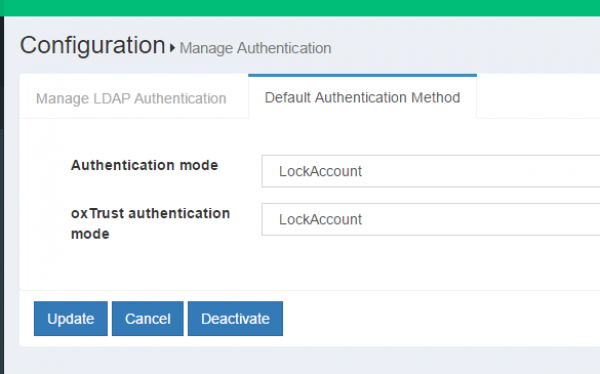

# Lock User in Gluu Server
This section deals with the locking of user after 4 failed login attempts. This feature requires using the interception script to achieve the goal. The login attempts are stored in a custom attribute which needs to be created first.

## Create Custom Attribute
The custom attribute `oxCountInvalidLogin` will track the unsuccessful login attempts by any user. Please create that attribute from the oxTrust Admin GUI.

* Click on the add user button under **Configuration**

* Please fill up the form as shown in the screenshot below

* Click the **Update** button and the custom attribute is added in the Gluu Server

## Script Installation

* Go to Manage Custom Scripts

* Click on the Person Authenticaiton tab

* Click on the Add custon script configuration button

* Fill up the form with the following information:

    1. Name: LockAccount

    2. Description: Basic Lock Account

    3. Programming Language: Python

    4. Level: 1

    5. Location Type: Ldap

    6. Usage Type: Both methods

    7. Custom property(key/value)

      1. invalid_login_count_attribute: oxCountInvalidLogin

      2. maximum_invalid_login_attemps: 4

    8. Script: [Lock User Account Script](https://github.com/GluuFederation/oxAuth/blob/master/Server/integrations/basic.lock.account/BasicLockAccountExternalAuthenticator.py)

    9. Enable the script by ticking the check box 

    10. Click Update 

    11. Change Default Authentication Method to LockAccount

